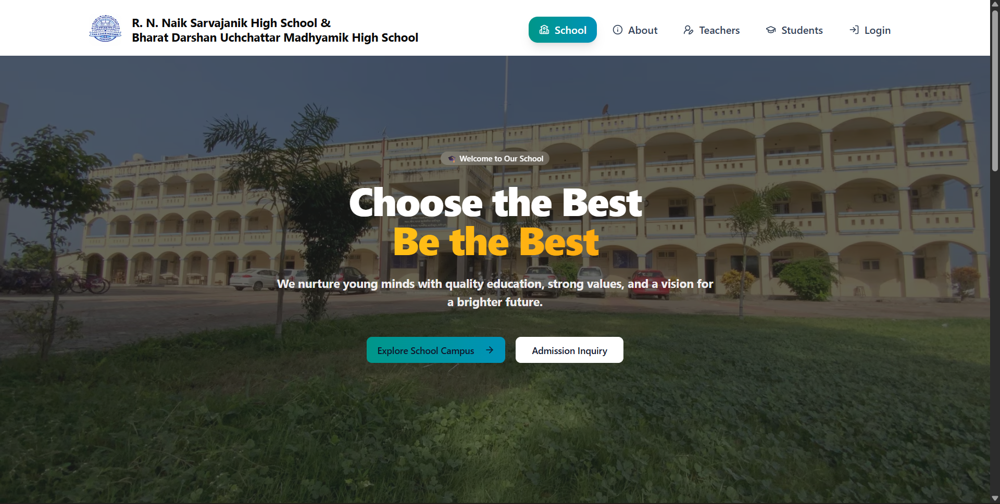

# School Platform

Full-stack school website and admin platform built as a pnpm monorepo.



## Overview

This repository contains:

- A public website built with Next.js (App Router)
- An admin-facing backend API built with Express + TypeScript
- MongoDB for application data
- Cloudinary for media uploads

## Tech Stack

- Frontend: Next.js 16, React 19, TypeScript, Tailwind CSS
- Backend: Express 5, TypeScript
- Database: MongoDB (Mongoose)
- Auth: JWT + HTTP-only cookies
- Media: Cloudinary + Multer
- Workspace: pnpm workspaces

## Monorepo Structure

```text
.
├─ client/    # Next.js frontend
├─ server/    # Express API server
└─ package.json
```

## Prerequisites

- Node.js 20+
- pnpm 9+
- MongoDB Atlas (or a MongoDB instance)
- Cloudinary account

## Quick Start

### 1) Install dependencies

From the workspace root:

```bash
pnpm install
```

### 2) Configure environment variables

Create your environment files:

- `server/.env`
- `client/.env.local`

Server required values:

```dotenv
NODE_ENV=development
PORT=10000

MONGODB_URI=mongodb+srv://<user>:<password>@<cluster>/<db>?retryWrites=true&w=majority
DB_NAME=school

JWT_SECRET=your_jwt_secret_here
ADMIN_EMAIL=admin@example.com
ADMIN_PASSWORD_HASH=your_bcrypt_hash_here

CLOUDINARY_CLOUD_NAME=your_cloud_name
CLOUDINARY_API_KEY=your_api_key
CLOUDINARY_API_SECRET=your_api_secret
```

Client required value:

```dotenv
NEXT_PUBLIC_API_URL=http://localhost:10000
```

### 3) Start development

From the workspace root:

```bash
pnpm dev
```

This runs both packages in parallel:

- Frontend: http://localhost:3000
- Backend: http://localhost:10000

## Workspace Scripts

Root:

```bash
pnpm dev
```

Frontend (`client`):

```bash
pnpm --filter client dev
pnpm --filter client build
pnpm --filter client start
pnpm --filter client lint
```

Backend (`server`):

```bash
pnpm --filter server dev
pnpm --filter server build
pnpm --filter server start
```

## API Health and Smoke Checks

- `GET /api/health` -> API status + uptime
- `GET /api/test-db/db-test` -> MongoDB connection state + user count

Example:

```bash
curl http://localhost:10000/api/health
curl http://localhost:10000/api/test-db/db-test
```

## Auth Notes

- Login endpoint: `POST /api/auth/login`
- Session check: `GET /api/auth/me`
- Logout endpoint: `POST /api/auth/logout`

The backend supports token auth and cookie-based auth for browser flows.

## Upload Endpoints

Protected upload routes (super admin) are available under `POST /api/upload/*`:

- `/teacher-photo`
- `/student-image`
- `/trustee-photo`
- `/campus-image`
- `/sports-image`

Expected form field for file upload: `image`

## Deployment Notes

- Set `NODE_ENV=production` in the backend environment.
- Ensure frontend and backend CORS origins are aligned.
- Set `NEXT_PUBLIC_API_URL` in the frontend deployment environment to your deployed API URL.
- Use strong secrets for `JWT_SECRET` and rotate credentials regularly.

## Troubleshooting

- API returns unauthorized:
  - Verify `JWT_SECRET` is set and consistent.
  - Check cookie settings (`sameSite`, `secure`) for your environment.
- Database connection fails:
  - Verify `MONGODB_URI` and network access in Atlas.
  - Confirm `DB_NAME` if not present in URI.
- Uploads fail:
  - Confirm Cloudinary variables are present and valid.

## License

Private project.
